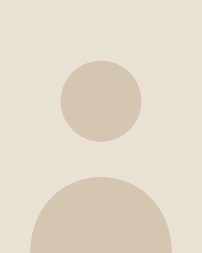

Homepagina. Voorbeeldtekst: vervang die door je eigen tekst.

[rij verhouding=3:2]
[sectie patroon=images/stippen.svg patroonkleur=olijf]
[label Orthomoleculaire therapie]
# Precies genoeg, ==voor jou==.
Orthomoleculaire therapie kijkt naar wat jouw lichaam nodig heeft: voeding, vitaminen, mineralen en rust. Niet te veel, niet te weinig.

[Plan een kennismaking](#contact)
[Zo werk ik](#werkwijze)

[sectie achtergrond=olijf]
> **lagom** *(Zweeds)*: precies genoeg; niet te veel, niet te weinig.

Volgens een volksverhaal komt het van *laget om*: de kom ging de kring rond en iedereen nam net genoeg, zodat er voor iedereen was.

[rij]
[sectie achtergrond=rood patroon=images/lijnen.svg schaal=2]
[label Aanbod]
## Waar ik je mee help
Van een eerste gesprek tot een plan dat in je dagelijks leven past.

[kaart]
### Voeding
Een eetpatroon dat bij je leven past, zonder strenge regels.

[kaart]
### Suppletie
Gericht aanvullen waar een tekort is, en niet meer dan nodig.

[kaart]
### Leefstijl
Slaap, stress en beweging in balans.

[rij verhouding=1:2]
[sectie achtergrond=licht]
[label Werkwijze]
## Stap voor stap
Elk traject begint met luisteren. Daarna maken we samen een plan en stellen dat bij waar nodig.

[Plan een kennismaking](#contact)

[sectie achtergrond=licht]
[tijdlijn Stap 1]
### Kennismaking
Een vrijblijvend gesprek van een halfuur: wat speelt er, en past mijn aanpak bij jou?

[tijdlijn Stap 2]
### Intake
We brengen je klachten, voeding en leefstijl uitgebreid in kaart.

[tijdlijn Stap 3]
### Advies op maat
Je krijgt een concreet plan voor voeding, suppletie en leefstijl.

[tijdlijn Stap 4]
### Begeleiding
In vervolgconsulten kijken we wat werkt en stellen we het plan bij.

[rij verhouding=2:3]
[sectie]

[sectie]
[label Over mij]
## Aandacht voor het geheel
Vertel hier in een paar zinnen wie je bent, wat je achtergrond is en waarom je dit werk doet.

Beschrijf je aanpak: hoe werk je samen met cliënten, en wat mogen ze van je verwachten?

- Persoonlijke aandacht
- Een plan dat past bij jouw leven
- **Niet te veel, niet te weinig**

[rij]
[sectie achtergrond=olijf]
[label Contact]
## Zin in een kennismaking?
Stuur een bericht, dan plannen we een vrijblijvend gesprek.

- Reactie binnen twee werkdagen
- Kennismaking is gratis

[sectie achtergrond=olijf]
[kaart]
### E-mail
Mail naar [a.b@c.com](mailto:a.b@c.com)

[kaart]
### Telefoon
06 – 12 34 56 78
